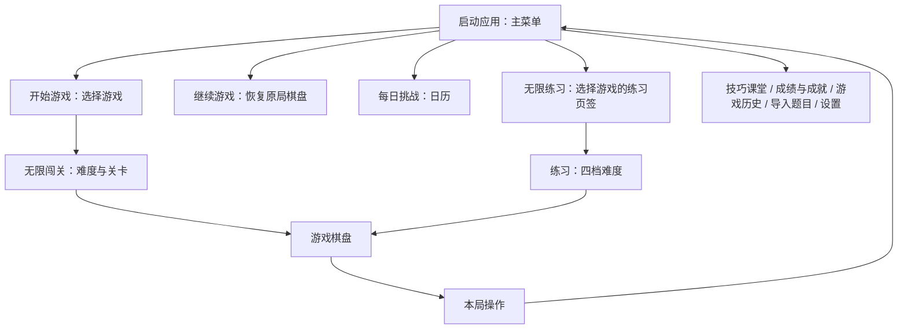

# 游戏主菜单与页面分层

日期：2026-09-30。根据用户提供的移动端首页截图与交互意见实施。原关卡页直接作为启动页，关卡网格占据主要空间，应用功能集中在“更多”弹层。本次将启动入口改为常驻游戏主菜单，关卡选择移入第二层。

## 页面结构

主菜单始终是 `pages/home/index`，仍排在路由表第一位。原首页迁入新增的 `pages/levels/index`。原有返回首页、通关返回首页和导航失败兜底均自然返回新的主菜单。

## 视觉与入口

- 顶部：数字方块标记、“数独”名称和直接可点的“设置”。
- 主题区域：蓝色渐变背景、倾斜的数独棋盘和数字卡片，配“让思维，玩一会儿。”文案。
- 主要按钮：没有未完成游戏时显示“开始游戏”；存在存档时显示“继续游戏”、游戏名称、填写进度和用时，并提供“选择其他关卡”。
- 常用模式：两个无边框的横向入口，使用实色圆形图标、深色标题、简短说明和右侧箭头。每日挑战显示今日是否完成及连续天数。
- 应用功能：技巧课堂、成绩与成就、游戏历史、导入题目收成一排图标导航，去掉独立方框和重复说明；完成过关卡时成绩入口额外显示完成数。设置位于顶部，分享以文字入口置于底部。
- 沿用应用的蓝色与主题变量，支持深色主题；小屏缩减装饰区域，自然纵向滚动，不固定页面高度。主要按钮及功能按钮触摸区域最小 48 CSS px，CSS px 不等于真机 dp 的验收结果。
- 主题区域有 0.35 秒进入动画，遵循减少动画偏好；按钮立即可用。主菜单无需等待倒计时或再点击“进入”。
- 关卡选择页只聚焦闯关/练习、难度与关卡。页头提供返回和玩法入口，保留既有无限关卡翻组、跳转、生成取消与成绩功能。
- 游戏页“更多”改为标题为“本局操作”的弹层，保留检查、书签、候选、重开、退出与保存，另提供“返回主菜单”。应用层功能从主菜单进入。

## 状态与导航规则

| 入口 | 行为 |
| --- | --- |
| 开始游戏 | 打开选择页；此时不生成题目、不覆盖存档 |
| 继续游戏 | 对当前局恢复计时，直接打开棋盘，保留原游戏 ID、候选和撤销栈；导航失败重新暂停 |
| 选择其他关卡 | 打开选择页，保留当前局；只有实际开始其他游戏时确认替换 |
| 无限练习 | 使用 `?mode=practice`，选择页直接定位练习页签 |
| 每日挑战 | 打开原有日历，可补玩、重玩与查看完成日期 |
| 返回主菜单 | 暂停并保存当前局，重建主菜单路由栈 |

主菜单展示时刷新成绩和每日状态，必要时恢复存档，并显式暂停当前局。这个暂停代表玩家主动回到菜单，与“后台自动暂停”设置分别处理。填写进度按非给定格的填写数计算，不通过正确数字数目泄露关闭即时检查时的正确性。装饰棋盘来自保留题库，不显示玩家被暂停的棋盘。

## 代码与脚本验证

- 主菜单：`src/pages/home/index.vue`。
- 二级选择页：`src/pages/levels/index.vue`。
- 路由注册：`src/pages.json`，共 12 个页面。
- 本局菜单：`src/components/common/MoreSheet.vue` 与 `src/pages/game/index.vue`。
- 回归脚本：`docs/validation/game-flows.spec.ts`，既有无限关卡页面回归迁移到选择页，新增 7 条主菜单、导航、恢复、暂停、每日刷新与返回菜单用例。

本次执行：类型检查通过；40 条业务与真实组件内存渲染回归通过；23 个 Vue SFC 的脚本/模板/样式内存编译与 12 条路由检查通过。完整 `npm run check` 套件现包含 73 条用例，本次未重复运行未改动的出题批量抽检。

## 下半部分视觉修订

用户补充截图反馈：下半部分卡片过多、颜色对比不足、边框和入口排列零散。按以下方式调整：

- 用两行玩法入口与一排四个工具图标替换原六个独立卡片，保留所有原有导航。
- 删除“探索更多乐趣”及副标题、工具入口的推广说明，减少文字层级与高度。
- 使用深蓝标题、较深的辅助文字与实色图标，浅色和深色主题分别配置配色。
- 校正 H5 按钮样式：已安装 uni-app 的按钮使用 `uni-button` 标签，默认自动水平边距和 `::after` 边框没有被原全局 `button` 规则覆盖。主页按钮增加 `.menu-control` 按类重置边距和伪元素，新玩法/工具入口明确占满布局单元；不影响其他页面样式。
- 页脚居中排布离线提示与文字分享入口，去掉分享按钮的默认边框。

修订后重新通过类型、40 条业务/页面回归、SFC 与路由源码校验。额外执行 `node docs/validation/check-home-contrast.cjs`，从真实源文件取色，用 sRGB 相对亮度计算浅色/深色主题、渐变两端背景与玩法图标的 24 组常态颜色对比，最低 5.81:1。脚本结果见 [颜色校验](../../validation/results/home-contrast.json)；不代表真机字体、按压状态或屏幕显示的验收。

没有启动工程、操控浏览器/电脑或操作 Git。以上验证覆盖代码与事件行为，真实屏幕布局、动画、触摸以及原生平台导航效果尚待设备验收。
